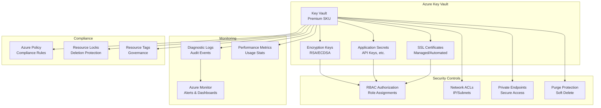

# Azure Key Vault Module - Enterprise Edition

This Terraform module creates a comprehensive Azure Key Vault with enterprise-grade security features, compliance controls, and operational capabilities.

## Features

### 🔐 Security & Compliance
- **Premium SKU** support with enhanced security features
- **Purge protection** and soft delete with configurable retention
- **RBAC authorization** with granular role assignments
- **Network ACLs** with IP restrictions and subnet whitelisting
- **Private endpoints** for secure access
- **Azure Policy integration** for automated compliance

### 🗝️ Key Management
- **RSA and ECDSA keys** with configurable sizes
- **Automatic key rotation** policies
- **Key versioning** and lifecycle management
- **Hardware Security Module (HSM)** support

### 🔒 Secret Management
- **Secure secret storage** with encryption at rest
- **Secret versioning** and access controls
- **Expiration dates** and notifications
- **Content type** classification

### 📜 Certificate Management
- **Automated certificate lifecycle** management
- **Integration with certificate authorities** (DigiCert, GlobalSign, etc.)
- **Certificate contacts** for renewal notifications
- **Subject alternative names** and extended key usage

### 📊 Monitoring & Logging
- **Diagnostic settings** with Log Analytics integration
- **Audit logging** for all operations
- **Metrics collection** for performance monitoring
- **Azure Monitor** integration

### 🔧 Operational Features
- **Resource locks** to prevent accidental deletion
- **Tags** for resource organization and cost tracking
- **Microsoft Cloud Adoption Framework (CAF)** naming conventions
- **Comprehensive validation** and error handling

## Architecture



## Usage

### Basic Example

```hcl
module "key_vault" {
  source = "./modules/security/key-vault"

  resource_group_name = "rg-enterprise-kv"
  location           = "East US"
  location_short     = "eus"
  environment        = "prod"

  # RBAC Authorization
  enable_rbac_authorization = true
  rbac_administrators      = [data.azurerm_client_config.current.object_id]

  # Security settings
  sku_name                   = "premium"
  purge_protection_enabled   = true
  soft_delete_retention_days = 90

  # Network security
  enable_network_acls = true
  network_acls_default_action = "Deny"

  # Monitoring
  enable_diagnostic_settings = true
  log_analytics_workspace_id = azurerm_log_analytics_workspace.example.id

  tags = {
    BusinessUnit = "IT"
    CostCenter   = "12345"
  }
}
```

### Enterprise Example

```hcl
module "key_vault_enterprise" {
  source = "./modules/security/key-vault"

  resource_group_name = "rg-enterprise-kv"
  location           = "East US"
  location_short     = "eus"
  environment        = "prod"

  # RBAC with multiple roles
  enable_rbac_authorization = true
  rbac_administrators      = [azuread_group.platform_admins.object_id]
  rbac_crypto_officers     = [azuread_group.security_team.object_id]
  rbac_secrets_users       = [azuread_group.app_developers.object_id]

  # Premium security
  sku_name                   = "premium"
  purge_protection_enabled   = true
  soft_delete_retention_days = 90
  public_network_access_enabled = false

  # Private networking
  enable_private_endpoint = true
  private_endpoint_subnet_id = azurerm_subnet.private_endpoints.id
  private_dns_zone_ids = [azurerm_private_dns_zone.keyvault.id]

  # Encryption keys
  keys = {
    "app-key" = {
      name     = "application-encryption-key"
      key_type = "RSA"
      key_size = 2048
      key_opts = ["decrypt", "encrypt", "sign", "verify"]
      rotation_policy = {
        expire_after         = "P1Y"
        notify_before_expiry = "P30D"
      }
    }
  }

  # Application secrets
  secrets = {
    "db-conn" = {
      name  = "database-connection-string"
      value = var.database_connection_string
      expiration_date = "2024-12-31T23:59:59Z"
    }
  }

  # SSL certificates
  certificates = {
    "ssl-cert" = {
      name = "wildcard-domain-com"
      issuer_parameters = {
        name = "DigiCert"
      }
      x509_certificate_properties = {
        subject            = "CN=*.domain.com"
        validity_in_months = 12
      }
    }
  }

  # Certificate contacts
  contacts = [
    {
      email = "security@domain.com"
      name  = "Security Team"
    }
  ]

  # Comprehensive monitoring
  enable_diagnostic_settings = true
  log_analytics_workspace_id = azurerm_log_analytics_workspace.example.id
  diagnostic_logs = ["AuditEvent", "AzurePolicyEvaluationDetails"]
  diagnostic_metrics = ["AllMetrics"]

  # Compliance controls
  enable_resource_lock = true
  enable_policy_assignments = true
  enable_policy_initiative  = true

  tags = {
    BusinessUnit    = "IT"
    Compliance      = "SOX"
    DataSensitivity = "High"
  }
}
```

## Requirements

| Name | Version |
|------|---------|
| <a name="requirement_terraform"></a> [terraform](#requirement\_terraform) | >= 1.5.0 |
| <a name="requirement_azurerm"></a> [azurerm](#requirement\_azurerm) | >= 3.80.0 |

## Providers

| Name | Version |
|------|---------|
| <a name="provider_azurerm"></a> [azurerm](#provider\_azurerm) | >= 3.80.0 |

## Modules

No modules.

## Resources

| Name | Type |
|------|------|
| [azurerm_key_vault.this](https://registry.terraform.io/providers/hashicorp/azurerm/latest/docs/resources/key_vault) | resource |
| [azurerm_key_vault_access_policy.this](https://registry.terraform.io/providers/hashicorp/azurerm/latest/docs/resources/key_vault_access_policy) | resource |
| [azurerm_role_assignment.key_vault_administrator](https://registry.terraform.io/providers/hashicorp/azurerm/latest/docs/resources/role_assignment) | resource |
| [azurerm_role_assignment.key_vault_secrets_officer](https://registry.terraform.io/providers/hashicorp/azurerm/latest/docs/resources/role_assignment) | resource |
| [azurerm_role_assignment.key_vault_secrets_user](https://registry.terraform.io/providers/hashicorp/azurerm/latest/docs/resources/role_assignment) | resource |
| [azurerm_role_assignment.key_vault_crypto_officer](https://registry.terraform.io/providers/hashicorp/azurerm/latest/docs/resources/role_assignment) | resource |
| [azurerm_role_assignment.key_vault_crypto_user](https://registry.terraform.io/providers/hashicorp/azurerm/latest/docs/resources/role_assignment) | resource |
| [azurerm_role_assignment.key_vault_certificates_officer](https://registry.terraform.io/providers/hashicorp/azurerm/latest/docs/resources/role_assignment) | resource |
| [azurerm_key_vault_key.this](https://registry.terraform.io/providers/hashicorp/azurerm/latest/docs/resources/key_vault_key) | resource |
| [azurerm_key_vault_secret.this](https://registry.terraform.io/providers/hashicorp/azurerm/latest/docs/resources/key_vault_secret) | resource |
| [azurerm_key_vault_certificate.this](https://registry.terraform.io/providers/hashicorp/azurerm/latest/docs/resources/key_vault_certificate) | resource |
| [azurerm_private_endpoint.this](https://registry.terraform.io/providers/hashicorp/azurerm/latest/docs/resources/private_endpoint) | resource |
| [azurerm_monitor_diagnostic_setting.this](https://registry.terraform.io/providers/hashicorp/azurerm/latest/docs/resources/monitor_diagnostic_setting) | resource |
| [azurerm_management_lock.this](https://registry.terraform.io/providers/hashicorp/azurerm/latest/docs/resources/management_lock) | resource |
| [azurerm_policy_definition.key_vault_key_rotation](https://registry.terraform.io/providers/hashicorp/azurerm/latest/docs/resources/policy_definition) | resource |
| [azurerm_policy_definition.key_vault_secret_expiration](https://registry.terraform.io/providers/hashicorp/azurerm/latest/docs/resources/policy_definition) | resource |
| [azurerm_policy_definition.key_vault_certificate_auto_renewal](https://registry.terraform.io/providers/hashicorp/azurerm/latest/docs/resources/policy_definition) | resource |
| [azurerm_policy_set_definition.key_vault_security_initiative](https://registry.terraform.io/providers/hashicorp/azurerm/latest/docs/resources/policy_set_definition) | resource |
| [azurerm_resource_group_policy_assignment.key_vault_purge_protection](https://registry.terraform.io/providers/hashicorp/azurerm/latest/docs/resources/resource_group_policy_assignment) | resource |
| [azurerm_resource_group_policy_assignment.key_vault_soft_delete](https://registry.terraform.io/providers/hashicorp/azurerm/latest/docs/resources/resource_group_policy_assignment) | resource |
| [azurerm_resource_group_policy_assignment.key_vault_firewall](https://registry.terraform.io/providers/hashicorp/azurerm/latest/docs/resources/resource_group_policy_assignment) | resource |
| [azurerm_resource_group_policy_assignment.key_vault_private_network](https://registry.terraform.io/providers/hashicorp/azurerm/latest/docs/resources/resource_group_policy_assignment) | resource |
| [azurerm_resource_group_policy_assignment.key_vault_logging](https://registry.terraform.io/providers/hashicorp/azurerm/latest/docs/resources/resource_group_policy_assignment) | resource |
| [azurerm_resource_group_policy_assignment.key_vault_private_link](https://registry.terraform.io/providers/hashicorp/azurerm/latest/docs/resources/resource_group_policy_assignment) | resource |
| [azurerm_resource_group_policy_assignment.key_vault_security_initiative](https://registry.terraform.io/providers/hashicorp/azurerm/latest/docs/resources/resource_group_policy_assignment) | resource |

## Inputs

| Name | Description | Type | Default | Required |
|------|-------------|------|---------|:--------:|
| <a name="input_name_prefix"></a> [name\_prefix](#input\_name\_prefix) | Prefix for resource naming. If empty, defaults to 'kv-{environment}-{location\_short}' | `string` | `""` | no |
| <a name="input_name_suffix"></a> [name\_suffix](#input\_name\_suffix) | Suffix for resource naming | `string` | `""` | no |
| <a name="input_custom_name"></a> [custom\_name](#input\_custom\_name) | Custom name for the Key Vault. If provided, name\_prefix and name\_suffix are ignored | `string` | `""` | no |
| <a name="input_location"></a> [location](#input\_location) | Azure region for the Key Vault | `string` | n/a | yes |
| <a name="input_location_short"></a> [location\_short](#input\_location\_short) | Short name for the location (e.g., 'eus' for East US) | `string` | n/a | yes |
| <a name="input_resource_group_name"></a> [resource\_group\_name](#input\_resource\_group\_name) | Name of the resource group | `string` | n/a | yes |
| <a name="input_environment"></a> [environment](#input\_environment) | Environment name (dev, test, prod, etc.) | `string` | n/a | yes |
| <a name="input_project_name"></a> [project\_name](#input\_project\_name) | Name of the project | `string` | `"enterprise"` | no |
| <a name="input_created_by"></a> [created\_by](#input\_created\_by) | Identifier of who created this resource | `string` | `"terraform"` | no |
| <a name="input_additional_tags"></a> [additional\_tags](#input\_additional\_tags) | Additional tags to add to resources | `map(string)` | `{}` | no |
| <a name="input_sku_name"></a> [sku\_name](#input\_sku\_name) | SKU name for the Key Vault (standard or premium) | `string` | `"standard"` | no |
| <a name="input_enabled_for_deployment"></a> [enabled\_for\_deployment](#input\_enabled\_for\_deployment) | Enable Key Vault for Azure Resource Manager deployment | `bool` | `false` | no |
| <a name="input_enabled_for_disk_encryption"></a> [enabled\_for\_disk\_encryption](#input\_enabled\_for\_disk\_encryption) | Enable Key Vault for disk encryption | `bool` | `true` | no |
| <a name="input_enabled_for_template_deployment"></a> [enabled\_for\_template\_deployment](#input\_enabled\_for\_template\_deployment) | Enable Key Vault for ARM template deployment | `bool` | `false` | no |
| <a name="input_enable_rbac_authorization"></a> [enable\_rbac\_authorization](#input\_enable\_rbac\_authorization) | Enable RBAC authorization instead of access policies | `bool` | `true` | no |
| <a name="input_purge_protection_enabled"></a> [purge\_protection\_enabled](#input\_purge\_protection\_enabled) | Enable purge protection for the Key Vault | `bool` | `true` | no |
| <a name="input_soft_delete_retention_days"></a> [soft\_delete\_retention\_days](#input\_soft\_delete\_retention\_days) | Number of days to retain deleted items | `number` | `90` | no |
| <a name="input_public_network_access_enabled"></a> [public\_network\_access\_enabled](#input\_public\_network\_access\_enabled) | Enable public network access | `bool` | `false` | no |
| <a name="input_enable_network_acls"></a> [enable\_network\_acls](#input\_enable\_network\_acls) | Enable network ACLs for the Key Vault | `bool` | `true` | no |
| <a name="input_network_acls_bypass"></a> [network\_acls\_bypass](#input\_network\_acls\_bypass) | Bypass options for network ACLs | `string` | `"AzureServices"` | no |
| <a name="input_network_acls_default_action"></a> [network\_acls\_default\_action](#input\_network\_acls\_default\_action) | Default action for network ACLs | `string` | `"Deny"` | no |
| <a name="input_network_acls_ip_rules"></a> [network\_acls\_ip\_rules](#input\_network\_acls\_ip\_rules) | List of IP rules for network ACLs | `list(string)` | `[]` | no |
| <a name="input_network_acls_subnet_ids"></a> [network\_acls\_subnet\_ids](#input\_network\_acls\_subnet\_ids) | List of subnet IDs for network ACLs | `list(string)` | `[]` | no |
| <a name="input_access_policies"></a> [access\_policies](#input\_access\_policies) | List of access policies for the Key Vault | <pre>map(object({<br>    tenant_id               = string<br>    object_id               = string<br>    key_permissions         = list(string)<br>    secret_permissions      = list(string)<br>    certificate_permissions = list(string)<br>    storage_permissions     = list(string)<br>  }))</pre> | `{}` | no |
| <a name="input_rbac_administrators"></a> [rbac\_administrators](#input\_rbac\_administrators) | List of principal IDs for Key Vault Administrator role | `list(string)` | `[]` | no |
| <a name="input_rbac_secrets_officers"></a> [rbac\_secrets\_officers](#input\_rbac\_secrets\_officers) | List of principal IDs for Key Vault Secrets Officer role | `list(string)` | `[]` | no |
| <a name="input_rbac_secrets_users"></a> [rbac\_secrets\_users](#input\_rbac\_secrets\_users) | List of principal IDs for Key Vault Secrets User role | `list(string)` | `[]` | no |
| <a name="input_rbac_crypto_officers"></a> [rbac\_crypto\_officers](#input\_rbac\_crypto\_officers) | List of principal IDs for Key Vault Crypto Officer role | `list(string)` | `[]` | no |
| <a name="input_rbac_crypto_users"></a> [rbac\_crypto\_users](#input\_rbac\_crypto\_users) | List of principal IDs for Key Vault Crypto User role | `list(string)` | `[]` | no |
| <a name="input_rbac_certificates_officers"></a> [rbac\_certificates\_officers](#input\_rbac\_certificates\_officers) | List of principal IDs for Key Vault Certificates Officer role | `list(string)` | `[]` | no |
| <a name="input_keys"></a> [keys](#input\_keys) | Map of keys to create in the Key Vault | <pre>map(object({<br>    name            = string<br>    key_type        = string<br>    key_size        = optional(number)<br>    key_opts        = list(string)<br>    curve           = optional(string)<br>    not_before_date = optional(string)<br>    expiration_date = optional(string)<br>    rotation_policy = optional(object({<br>      time_before_expiry = optional(string)<br>      expire_after        = optional(string)<br>      notify_before_expiry = optional(string)<br>    }))<br>    tags = optional(map(string), {})<br>  }))</pre> | `{}` | no |
| <a name="input_secrets"></a> [secrets](#input\_secrets) | Map of secrets to create in the Key Vault | <pre>map(object({<br>    name            = string<br>    value           = string<br>    content_type    = optional(string)<br>    not_before_date = optional(string)<br>    expiration_date = optional(string)<br>    tags            = optional(map(string), {})<br>  }))</pre> | `{}` | no |
| <a name="input_certificates"></a> [certificates](#input\_certificates) | Map of certificates to create in the Key Vault | <pre>map(object({<br>    name = string<br>    issuer_parameters = object({<br>      name = string<br>    })<br>    key_properties = object({<br>      exportable = bool<br>      key_size   = number<br>      key_type   = string<br>      reuse_key  = bool<br>    })<br>    secret_properties = object({<br>      content_type = string<br>    })<br>    x509_certificate_properties = object({<br>      extended_key_usage = list(string)<br>      key_usage          = list(string)<br>      subject            = string<br>      validity_in_months = number<br>      subject_alternative_names = object({<br>        dns_names = list(string)<br>        emails    = list(string)<br>        upns      = list(string)<br>      })<br>    })<br>    tags = optional(map(string), {})<br>  }))</pre> | `{}` | no |
| <a name="input_contacts"></a> [contacts](#input\_contacts) | List of contacts for certificate management | <pre>list(object({<br>    email = string<br>    name  = optional(string)<br>    phone = optional(string)<br>  }))</pre> | `[]` | no |
| <a name="input_enable_private_endpoint"></a> [enable\_private\_endpoint](#input\_enable\_private\_endpoint) | Enable private endpoint for the Key Vault | `bool` | `true` | no |
| <a name="input_private_endpoint_subnet_id"></a> [private\_endpoint\_subnet\_id](#input\_private\_endpoint\_subnet\_id) | Subnet ID for the private endpoint | `string` | `null` | no |
| <a name="input_private_dns_zone_ids"></a> [private\_dns\_zone\_ids](#input\_private\_dns\_zone\_ids) | List of private DNS zone IDs for the private endpoint | `list(string)` | `null` | no |
| <a name="input_enable_diagnostic_settings"></a> [enable\_diagnostic\_settings](#input\_enable\_diagnostic\_settings) | Enable diagnostic settings for the Key Vault | `bool` | `true` | no |
| <a name="input_log_analytics_workspace_id"></a> [log\_analytics\_workspace\_id](#input\_log\_analytics\_workspace\_id) | Log Analytics workspace ID for diagnostic settings | `string` | `null` | no |
| <a name="input_diagnostic_logs"></a> [diagnostic\_logs](#input\_diagnostic\_logs) | List of diagnostic logs to enable | `list(string)` | <pre>[<br>  "AuditEvent",<br>  "AzurePolicyEvaluationDetails"<br>]</pre> | no |
| <a name="input_diagnostic_metrics"></a> [diagnostic\_metrics](#input\_diagnostic\_metrics) | List of diagnostic metrics to enable | `list(string)` | <pre>[<br>  "AllMetrics"<br>]</pre> | no |
| <a name="input_enable_resource_lock"></a> [enable\_resource\_lock](#input\_enable\_resource\_lock) | Enable resource lock for the Key Vault | `bool` | `true` | no |
| <a name="input_resource_lock_level"></a> [resource\_lock\_level](#input\_resource\_lock\_level) | Level of the resource lock | `string` | `"CanNotDelete"` | no |
| <a name="input_enable_policy_assignments"></a> [enable\_policy\_assignments](#input\_enable\_policy\_assignments) | Enable Azure Policy assignments for Key Vault | `bool` | `true` | no |
| <a name="input_resource_group_id"></a> [resource\_group\_id](#input\_resource\_group\_id) | Resource group ID for policy assignments | `string` | `null` | no |
| <a name="input_enable_custom_policies"></a> [enable\_custom\_policies](#input\_enable\_custom\_policies) | Enable custom Azure Policy definitions | `bool` | `false` | no |
| <a name="input_enable_policy_initiative"></a> [enable\_policy\_initiative](#input\_enable\_policy\_initiative) | Enable Azure Policy initiative for Key Vault security | `bool` | `true` | no |

## Outputs

| Name | Description |
|------|-------------|
| <a name="output_key_vault_id"></a> [key\_vault\_id](#output\_key\_vault\_id) | The ID of the Key Vault |
| <a name="output_key_vault_name"></a> [key\_vault\_name](#output\_key\_vault\_name) | The name of the Key Vault |
| <a name="output_key_vault_uri"></a> [key\_vault\_uri](#output\_key\_vault\_uri) | The URI of the Key Vault |
| <a name="output_key_vault_resource_group_name"></a> [key\_vault\_resource\_group\_name](#output\_key\_vault\_resource\_group\_name) | The resource group name of the Key Vault |
| <a name="output_key_vault_location"></a> [key\_vault\_location](#output\_key\_vault\_location) | The location of the Key Vault |
| <a name="output_key_vault_tenant_id"></a> [key\_vault\_tenant\_id](#output\_key\_vault\_tenant\_id) | The tenant ID of the Key Vault |
| <a name="output_key_ids"></a> [key\_ids](#output\_key\_ids) | Map of key names to key IDs |
| <a name="output_key_versions"></a> [key\_versions](#output\_key\_versions) | Map of key names to key versions |
| <a name="output_key_public_keys"></a> [key\_public\_keys](#output\_key\_public\_keys) | Map of key names to public key PEMs |
| <a name="output_secret_ids"></a> [secret\_ids](#output\_secret\_ids) | Map of secret names to secret IDs |
| <a name="output_secret_versions"></a> [secret\_versions](#output\_secret\_versions) | Map of secret names to secret versions |
| <a name="output_certificate_ids"></a> [certificate\_ids](#output\_certificate\_ids) | Map of certificate names to certificate IDs |
| <a name="output_certificate_versions"></a> [certificate\_versions](#output\_certificate\_versions) | Map of certificate names to certificate versions |
| <a name="output_certificate_thumbprints"></a> [certificate\_thumbprints](#output\_certificate\_thumbprints) | Map of certificate names to certificate thumbprints |
| <a name="output_private_endpoint_id"></a> [private\_endpoint\_id](#output\_private\_endpoint\_id) | The ID of the private endpoint |
| <a name="output_private_endpoint_ip_address"></a> [private\_endpoint\_ip\_address](#output\_private\_endpoint\_ip\_address) | The private IP address of the private endpoint |
| <a name="output_rbac_role_assignments"></a> [rbac\_role\_assignments](#output\_rbac\_role\_assignments) | Map of RBAC role assignments created |
| <a name="output_access_policy_ids"></a> [access\_policy\_ids](#output\_access\_policy\_ids) | Map of access policy keys to policy IDs |
| <a name="output_diagnostic_setting_id"></a> [diagnostic\_setting\_id](#output\_diagnostic\_setting\_id) | The ID of the diagnostic setting |
| <a name="output_resource_lock_id"></a> [resource\_lock\_id](#output\_resource\_lock\_id) | The ID of the resource lock |
| <a name="output_resource_tags"></a> [resource\_tags](#output\_resource\_tags) | Tags applied to the Key Vault |
| <a name="output_purge_protection_enabled"></a> [purge\_protection\_enabled](#output\_purge\_protection\_enabled) | Whether purge protection is enabled |
| <a name="output_soft_delete_enabled"></a> [soft\_delete\_enabled](#output\_soft\_delete\_enabled) | Whether soft delete is enabled |
| <a name="output_network_acls_enabled"></a> [network\_acls\_enabled](#output\_network\_acls\_enabled) | Whether network ACLs are enabled |
| <a name="output_private_endpoint_enabled"></a> [private\_endpoint\_enabled](#output\_private\_endpoint\_enabled) | Whether private endpoint is enabled |
| <a name="output_rbac_enabled"></a> [rbac\_enabled](#output\_rbac\_enabled) | Whether RBAC authorization is enabled |

## Testing

The module includes comprehensive tests using Terratest:

```bash
cd modules/security/key-vault/test
go test -v -timeout 30m
```

Test scenarios include:
- Enterprise Key Vault with RBAC and security features
- Access policies validation
- Network security configuration
- Input validation and error handling

## Security Considerations

### 🔐 Key Security Features
- **Purge Protection**: Prevents permanent deletion of secrets
- **Soft Delete**: Allows recovery of deleted items
- **RBAC Authorization**: Granular access control using Azure RBAC
- **Network Restrictions**: Private endpoints and network ACLs
- **Audit Logging**: Comprehensive audit trails

### 🛡️ Compliance
- **Azure Policy Integration**: Automated compliance monitoring
- **Resource Locks**: Prevention of accidental deletion
- **Key Rotation**: Automatic key lifecycle management
- **Certificate Management**: Automated certificate renewal

### 📋 Best Practices
1. Use premium SKU for production workloads
2. Enable purge protection and soft delete
3. Configure private endpoints for secure access
4. Use RBAC instead of access policies for new deployments
5. Enable diagnostic logging and monitoring
6. Configure key rotation policies
7. Use resource locks in production
8. Regularly review access permissions

## Contributing

1. Follow the established code structure and naming conventions
2. Add comprehensive tests for new features
3. Update documentation for any changes
4. Ensure all tests pass before submitting PR
5. Follow security best practices

## License

This module is licensed under the MIT License. See LICENSE file for details.

## Support

For issues and questions:
- Create an issue in the repository
- Review the documentation and examples
- Check the test logs for debugging information

---

**Note**: This module is designed for enterprise use and includes security features that may require additional Azure permissions or configurations. Always test in a development environment before deploying to production.